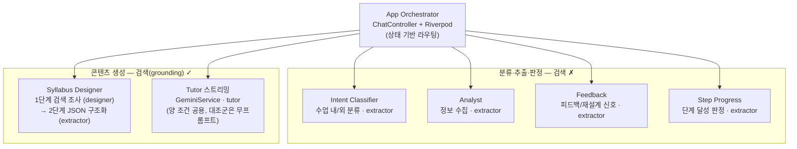
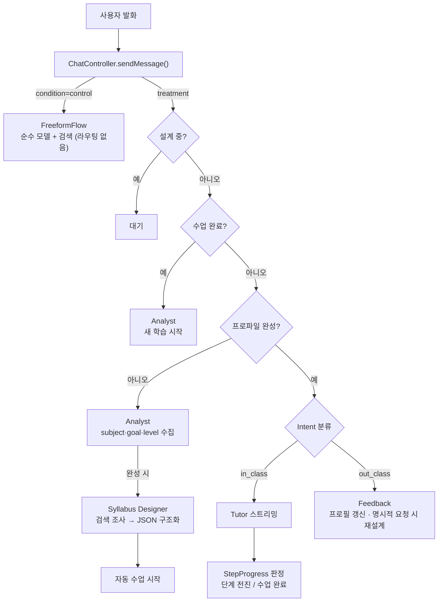

# Journal Experiment

ADDIE 모델 기반 적응형 학습 튜터 — **피험자 간 2조건(Between-Subjects) 실험 시스템**.

- **처치군(treatment)**: ADDIE 구조화 오케스트레이션 (Intent 분류 · Analyst · Feedback · Syllabus Designer · 단계 추적)
- **대조군(control)**: 시스템 프롬프트가 전혀 없는 순수(바닐라) 모델
- **공통 통제**: 학습자 대면 모델(`gemini-3.5-flash`) · Google Search grounding · Gemini 스타일 UI · 대화 메모리(세션 전체) — 두 조건의 유일한 차이는 **오케스트레이션 구조의 유무(독립변인)**

자료 취득은 로컬 캐시(RAG/Wikidata/자료 박제) 없이 **`Tool.googleSearch()` grounding**으로만 이뤄진다. 모델이 필요할 때 스스로 검색해 그 자료에 근거해 설계·튜터링한다.

---

## 실험 조건 접속 (URL 분기)

조건은 페이지 로드 시 **URL 쿼리 파라미터**로 결정된다 (`lib/config/experiment_config.dart`). 별도 엔드포인트나 빌드가 아니라 **같은 앱, 같은 주소에 쿼리만 다르게** 붙인다.

| 조건 | URL |
|------|-----|
| 처치군 (ADDIE) | `http://<HOST>:<PORT>/?condition=treatment` |
| 대조군 (순수 모델) | `http://<HOST>:<PORT>/?condition=control` |

- 대조군으로 인식되는 값은 `control`, `freeform`, `free` 세 가지. **그 밖의 모든 경우(미지정·오타 포함)는 조용히 처치군으로 폴백**하므로 링크 배포 시 오타에 주의한다.
- 쿼리는 반드시 `#` **앞**에 와야 한다. `…/?condition=control` ✅ / `…/#/?condition=control` ❌ (`Uri.base.queryParameters`에 잡히지 않아 처치군이 된다).
- 조건은 페이지 로드 시점에 고정된다. 바꾸려면 주소를 고쳐 **새로고침**.
- 학습 상태가 SharedPreferences에 남으므로 **참가자마다 시크릿 창**을 쓴다 (또는 상단 초기화 버튼 ↻).
- 화면만으로는 조건을 구분할 수 없다 (UI 완전 동일). 확인은 **내보내기 JSON의 `experiment.condition`** 또는 파일명으로 한다. 콘솔 로그 `[Flow] condition`은 대조군일 때만 찍힌다.

```bash
# 로컬 실행 예시
flutter run -d chrome --web-port 8080
# → http://localhost:8080/?condition=treatment
# → http://localhost:8080/?condition=control
```

---

## 모델·API 엔드포인트 변경 방법

모든 Gemini 모델명과 Vertex AI location(엔드포인트)은 **`lib/config/ai_models.dart` 한 파일에 중앙화**되어 있다. 모델이나 리전을 바꿀 때는 이 파일의 `ModelSpec(모델명, location)` 쌍만 수정하면 된다.

```dart
// lib/config/ai_models.dart
class AiModels {
  /// 분류·추출용 (Intent / Analyst / Feedback / StepProgress / Syllabus 2단계 구조화)
  static const ModelSpec extractor = ModelSpec('gemini-2.5-flash', 'us-central1');

  /// 학습자 대면 스트리밍 (처치군 Tutor + 대조군 순수 모델 공용) — 양 조건 동일(통제 변인)
  static const ModelSpec tutor = ModelSpec('gemini-3.5-flash', 'global');

  /// 교수설계 1단계 (grounding 검색 조사)
  static const ModelSpec designer = ModelSpec('gemini-3.5-flash', 'global');
}
```

### location(엔드포인트) 제약 — `addie-tutor` 프로젝트 기준

| 모델 | 가능한 location | 비고 |
|------|----------------|------|
| `gemini-2.5-flash` | `us-central1` | `global`은 라우팅 불안정(404 잦음) |
| `gemini-3.5-flash` | `global` **전용** | `us-central1`에서 404 |
| `gemini-2.0-flash` | 사용 불가 | Vertex AI에서 retire됨 (404) |
| `gemini-3-flash-preview` | 사용 불가 | `us-central1`에서 404 |

주의사항:

- **`tutor`는 양 조건이 공유**하므로 이 값 하나만 바꾸면 두 조건이 함께 바뀐다 (실험 통제 유지).
- `googleSearch` 도구와 `responseSchema`(JSON 강제)는 **한 호출에서 병용 불가** — 검색이 필요한 에이전트에 JSON 출력을 시키려면 Syllabus Designer처럼 2단계(검색·초안 → JSON 구조화)로 나눠야 한다.
- Firebase AI Logic이 Vertex AI를 호출하려면 서비스 에이전트 `service-<PROJECT_NUMBER>@gcp-sa-firebasevertexai.iam.gserviceaccount.com`에 `roles/aiplatform.user`가 필요 (없으면 앱에서 403).

---

## 아키텍처: Stateless Micro-Agent Pattern (처치군)

"LLM이 판단"하는 Fat Agent가 아니라 **"앱이 판단하고 LLM은 생성만"** 하는 구조. 상태는 Riverpod이 들고, `ChatController`가 상태를 보고 에이전트를 라우팅한다.



- **검색(grounding)을 가진 에이전트는 둘뿐**: Syllabus Designer 1단계(기존 커리큘럼·시험 범위 조사)와 학습자 대면 스트리밍(Tutor/대조군 공용). 분류·추출·판정 에이전트는 검색이 불필요하다.
- 모든 에이전트의 **시스템 프롬프트는 `lib/config/agent_prompts.dart`에 중앙화** — 프롬프트 수정은 이 파일만. 대조군용 프롬프트는 존재하지 않는다(무프롬프트가 조건 정의).
- 처치군 Tutor는 프롬프트를 `systemInstruction`으로 주입하며(매 턴 상태 반영 재빌드), 대화 이력은 chat history로, 사용자 발화는 user 메시지로 분리 전달된다.
- **대조군은 `_runFreeformFlow`가 모든 라우팅을 건너뛰고** systemInstruction 없이 사용자 발화를 그대로 모델에 전달한다.

---

## 실험 데이터 수집

### 세션 내보내기 (⬇ 버튼)

`exportVersion: "2.1"`. 파일명은 `YYYYMMDD_HHMM_<조건>_<제목>.json` — 열지 않고도 조건별로 분류된다.

```jsonc
{
  "exportVersion": "2.1",
  "experiment": { "condition": "control" },   // treatment | control ← 분석 시 조건 구분의 근거
  "session": { "id": "...", "title": "...", "createdAt": "..." },
  "timeline": [
    { "type": "student",   "timestamp": "...", "content": "..." },
    { "type": "tutor",     "timestamp": "...", "content": "..." },
    { "type": "profile",   "timestamp": "...", "profile": { ... } },      // 처치군만
    { "type": "syllabus",  "timestamp": "...", "syllabus": [ ... ] },     // 처치군만
    { "type": "grounding", "timestamp": "...", "source": "tutor",         // 양 조건
      "searchQueries": [ ... ], "sources": ["제목 (URI)", ...] }
  ]
}
```

대조군은 상태 변화가 없어 타임라인이 메시지 + grounding만으로 구성된다. 조건은 파일을 봐서는 역추정할 수 없으므로 `experiment.condition`이 유일한 근거다.

### Grounding 로깅 (조절변수 '자료 검색 빈도')

검색이 발동한 턴은 두 곳에 기록된다:

- 콘솔: `[Flow] grounding.tutor|freeform|designer` — 검색어(`searchQueries`)와 근거 소스(`sources`)
- 내보내기 JSON: `timeline`의 `type: "grounding"` 항목 (`source`는 `tutor` | `freeform` | `designer`)

grounding은 모델이 필요하다고 판단할 때만 발동하므로 모든 턴에 로그가 찍히지 않는 것이 정상이다.

---

## 실행 방법

### 1. Flutter 웹 앱

```bash
flutter pub get
flutter pub run build_runner build --delete-conflicting-outputs  # @riverpod 변경 시
flutter run -d chrome --web-port 8080
```

### 2. Firebase 설정 파일이 없을 때 (1회)

```bash
npm install -g firebase-tools && firebase login
dart pub global activate flutterfire_cli
flutterfire configure --project=addie-tutor --platforms=web
```

`lib/firebase_options.dart`에 API 키가 포함되므로 저장소에 커밋하지 않는다.

> 별도 백엔드 서버는 없다. 이전의 RAG 서버(`scripts/rag/`)와 Wikidata 프록시는 grounding 전환으로 **폐기**되었다 (스크립트는 참고용으로만 남아 있음).

---

## 실험 운영

- **단일 세션 모드**: 사이드바 없음, 한 번에 하나의 학습 흐름.
- **초기화(↻)**: 대화 + 학습 상태(SharedPreferences 포함) 전체 리셋. 참가자 교체 시 필수 (시크릿 창을 쓴다면 자동 해결).
- **대화 메모리**: 양 조건 동일하게 **세션 전체 히스토리**를 스트리밍 호출에 전달. 판정 에이전트(StepProgress/Feedback)만 최근 6개 윈도우 사용.
- **UI 동일성**: Google Gemini 웹 앱 스타일(중앙 입력 필 + 글로우, 회청색 사용자 버블, 라이트 블루 전송 버튼). **두 조건의 화면은 완전히 동일하다.**
  - 로드맵 UI(상단 진행 헤더 · 목차 모달 · "로드맵 생성 중/준비 완료" 배너)는 `ExperimentConfig.showLearningRoadmap=false`로 **전부 비노출**. 내부 단계 추적(`currentStepIndex`)과 진행 판정은 그대로 동작한다.
  - 학습자에게 보이는 문구에는 '로드맵'처럼 **시각물을 암시하는 표현을 쓰지 않는다**. 보이지 않는 것을 예고하면 학습자가 찾아 헤매게 되어, 주 종속변수인 지각된 방향상실을 인위적으로 올리기 때문이다.
  - 설계(Syllabus 생성)가 도는 동안에는 양 조건 공용인 **타이핑 인디케이터**가 대기 피드백을 담당한다.

---

## 프로젝트 구조

```
lib/
├── main.dart                      # 앱 진입점 + Gemini 스타일 테마
├── firebase_options.dart          # Firebase 설정 (addie-tutor, gitignore)
│
├── config/
│   ├── ai_models.dart             # ⭐ 모델·location(엔드포인트) 중앙 설정
│   ├── agent_prompts.dart         # ⭐ 전체 에이전트 시스템 프롬프트 중앙화
│   └── experiment_config.dart     # ⭐ 실험 조건 URL 분기 + 로드맵 가시성
│
├── models/
│   ├── message.dart / chat_session.dart
│   ├── learner_profile.dart       # subject·goal·level(필수), tone(선택)
│   ├── instructional_design.dart  # Step, Syllabus
│   ├── learning_state.dart        # 통합 학습 상태 (자료 캐시 없음 — grounding 전용)
│   └── state_change_event.dart    # 상태 변화 타임라인 (groundingUsed 포함)
│
├── providers/
│   ├── chat_provider.dart         # ⭐ 오케스트레이션 + 조건 분기 + grounding 로깅
│   └── learning_state_provider.dart
│
├── services/
│   ├── gemini_service.dart        # 학습자 대면 스트리밍 (grounding + systemInstruction, 양 조건 공용)
│   ├── intent_classifier_service.dart
│   ├── conversational_agent_service.dart # Analyst / Feedback / Tutor systemInstruction
│   ├── syllabus_designer_service.dart    # 2단계: 검색 조사 → JSON 구조화
│   ├── step_progress_service.dart
│   └── session_export_service.dart       # 조건·grounding 포함 JSON 내보내기
│
├── screens/chat_screen.dart
└── widgets/                       # chat_view, chat_input, message_bubble, typing_indicator
```

---

## 상태 흐름



---

## 라이선스

MIT License
