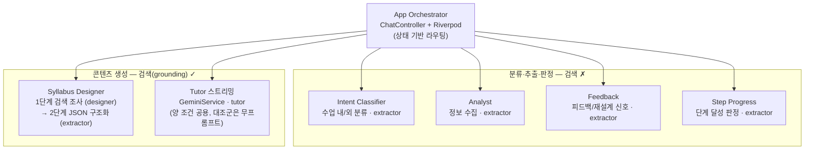
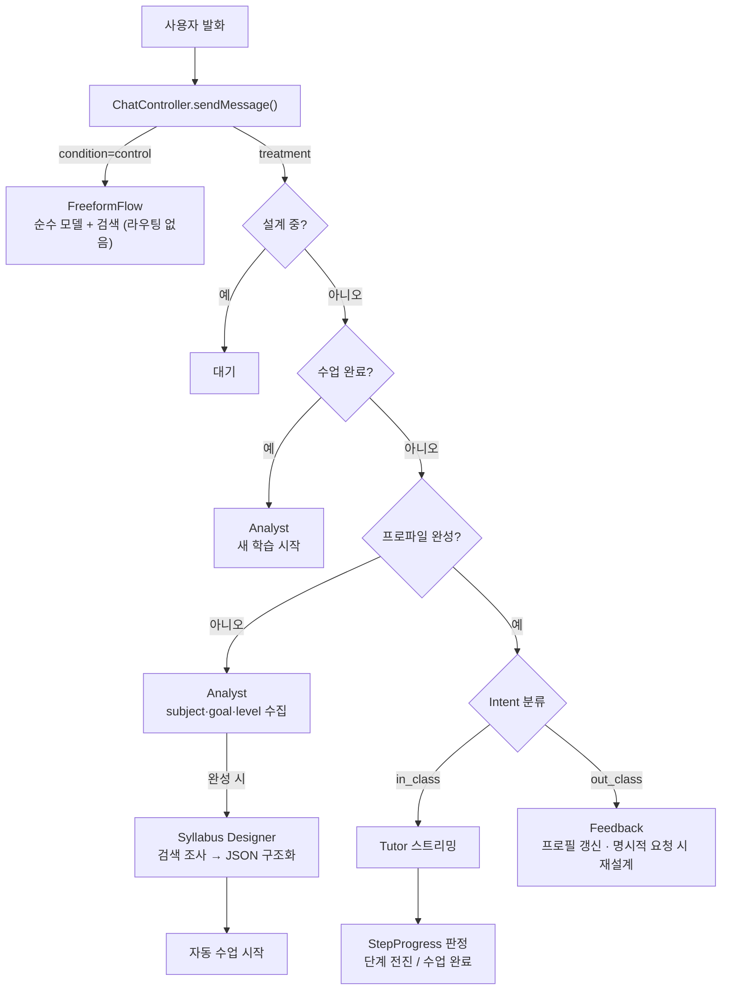

# Journal Experiment

ADDIE 모델 기반 적응형 학습 튜터 — **피험자 간 2조건(Between-Subjects) 실험 시스템**.

- **처치군(treatment)**: ADDIE 구조화 오케스트레이션 (Intent 분류 · Analyst · Feedback · Syllabus Designer · 단계 추적)
- **대조군(control)**: 시스템 프롬프트가 전혀 없는 순수(바닐라) 모델
- **공통 통제**: 학습자 대면 모델(`gemini-3.5-flash`) · Google Search grounding · Gemini 스타일 UI · 대화 메모리(세션 전체) — 두 조건의 유일한 차이는 **오케스트레이션 구조의 유무(독립변인)**

자료 취득은 로컬 캐시(RAG/Wikidata/자료 박제) 없이 **`Tool.googleSearch()` grounding**으로만 이뤄진다. 모델이 필요할 때 스스로 검색해 그 자료에 근거해 설계·튜터링한다.

---

## 실험 조건 접속 (URL 분기)

조건은 페이지 로드 시 **URL 쿼리 파라미터**로 결정된다 (`lib/config/experiment_config.dart`). 별도 엔드포인트나 빌드가 아니라 **같은 앱, 같은 주소에 쿼리만 다르게** 붙인다.

| 조건 | URL |
|------|-----|
| 처치군 (ADDIE) | `http://<HOST>:<PORT>/?condition=treatment` |
| 대조군 (순수 모델) | `http://<HOST>:<PORT>/?condition=control` |

- 대조군으로 인식되는 값은 `control`, `freeform`, `free` 세 가지. **그 밖의 모든 경우(미지정·오타 포함)는 조용히 처치군으로 폴백**하므로 링크 배포 시 오타에 주의한다.
- 쿼리는 반드시 `#` **앞**에 와야 한다. `…/?condition=control` ✅ / `…/#/?condition=control` ❌ (`Uri.base.queryParameters`에 잡히지 않아 처치군이 된다).
- 조건은 페이지 로드 시점에 고정된다. 바꾸려면 주소를 고쳐 **새로고침**.
- 학습 상태가 SharedPreferences에 남지만, **시작 화면의 시작 버튼이 대화·학습 상태·텔레메트리를 전부 초기화**하므로 참가자 교체는 새로고침 → 이름 입력 → 시작으로 끝난다.
- 선택 쿼리: `&pc=A`(현장 PC 식별자, 파일명·JSON에 기록), `&pid=P07`(시작 화면 이름 칸 미리 채움).
- 화면만으로는 조건을 구분할 수 없다 (UI 완전 동일). 확인은 **내보내기 JSON의 `experiment.condition`** 또는 파일명으로 한다. 콘솔 로그 `[Flow] condition`은 대조군일 때만 찍힌다.

```bash
# 로컬 실행 예시
flutter run -d chrome --web-port 8080
# → http://localhost:8080/?condition=treatment
# → http://localhost:8080/?condition=control
```

---

## 모델·API 엔드포인트 변경 방법

모든 Gemini 모델명과 Vertex AI location(엔드포인트)은 **`lib/config/ai_models.dart` 한 파일에 중앙화**되어 있다. 모델이나 리전을 바꿀 때는 이 파일의 `ModelSpec(모델명, location)` 쌍만 수정하면 된다.

```dart
// lib/config/ai_models.dart
class AiModels {
  /// 분류·추출용 (Intent / Analyst / Feedback / StepProgress / Syllabus 2단계 구조화)
  static const ModelSpec extractor = ModelSpec('gemini-2.5-flash', 'us-central1');

  /// 학습자 대면 스트리밍 (처치군 Tutor + 대조군 순수 모델 공용) — 양 조건 동일(통제 변인)
  static const ModelSpec tutor = ModelSpec('gemini-3.5-flash', 'global');

  /// 교수설계 1단계 (grounding 검색 조사)
  static const ModelSpec designer = ModelSpec('gemini-3.5-flash', 'global');
}
```

### location(엔드포인트) 제약 — `addie-tutor` 프로젝트 기준

| 모델 | 가능한 location | 비고 |
|------|----------------|------|
| `gemini-2.5-flash` | `us-central1` | `global`은 라우팅 불안정(404 잦음) |
| `gemini-3.5-flash` | `global` **전용** | `us-central1`에서 404 |
| `gemini-2.0-flash` | 사용 불가 | Vertex AI에서 retire됨 (404) |
| `gemini-3-flash-preview` | 사용 불가 | `us-central1`에서 404 |

주의사항:

- **`tutor`는 양 조건이 공유**하므로 이 값 하나만 바꾸면 두 조건이 함께 바뀐다 (실험 통제 유지).
- `googleSearch` 도구와 `responseSchema`(JSON 강제)는 **한 호출에서 병용 불가** — 검색이 필요한 에이전트에 JSON 출력을 시키려면 Syllabus Designer처럼 2단계(검색·초안 → JSON 구조화)로 나눠야 한다.
- Firebase AI Logic이 Vertex AI를 호출하려면 서비스 에이전트 `service-<PROJECT_NUMBER>@gcp-sa-firebasevertexai.iam.gserviceaccount.com`에 `roles/aiplatform.user`가 필요 (없으면 앱에서 403).

---

## 아키텍처: Stateless Micro-Agent Pattern (처치군)

"LLM이 판단"하는 Fat Agent가 아니라 **"앱이 판단하고 LLM은 생성만"** 하는 구조. 상태는 Riverpod이 들고, `ChatController`가 상태를 보고 에이전트를 라우팅한다.


```mermaid
flowchart TB
    O["App Orchestrator<br/>ChatController + Riverpod<br/>(상태 기반 라우팅)"]

    subgraph NOSEARCH["분류·추출·판정 — 검색 ✗"]
        IC["Intent Classifier<br/>수업 내/외 분류 · extractor"]
        AN["Analyst<br/>정보 수집 · extractor"]
        FB["Feedback<br/>피드백/재설계 신호 · extractor"]
        SP["Step Progress<br/>단계 달성 판정 · extractor"]
    end

    subgraph SEARCH["콘텐츠 생성 — 검색(grounding) ✓"]
        SD["Syllabus Designer<br/>1단계 검색 조사 (designer)<br/>→ 2단계 JSON 구조화 (extractor)"]
        TU["Tutor 스트리밍<br/>GeminiService · tutor<br/>(양 조건 공용, 대조군은 무프롬프트)"]
    end

    O --> IC
    O --> AN
    O --> FB
    O --> SP
    O --> SD
    O --> TU
```

- **검색(grounding)을 가진 에이전트는 둘뿐**: Syllabus Designer 1단계(기존 커리큘럼·시험 범위 조사)와 학습자 대면 스트리밍(Tutor/대조군 공용). 분류·추출·판정 에이전트는 검색이 불필요하다.
- 모든 에이전트의 **시스템 프롬프트는 `lib/config/agent_prompts.dart`에 중앙화** — 프롬프트 수정은 이 파일만. 대조군용 프롬프트는 존재하지 않는다(무프롬프트가 조건 정의).
- 처치군 Tutor는 프롬프트를 `systemInstruction`으로 주입하며(매 턴 상태 반영 재빌드), 대화 이력은 chat history로, 사용자 발화는 user 메시지로 분리 전달된다.
- **대조군은 `_runFreeformFlow`가 모든 라우팅을 건너뛰고** systemInstruction 없이 사용자 발화를 그대로 모델에 전달한다.

---

## 실험 데이터 수집

### 시작 화면 (t=0)

앱은 **참가자 이름 + 시작 버튼** 화면으로 시작한다. 시작 버튼을 누르는 순간이 실험의 기준 시각(`participant.startedAt`)이며, 이때 대화·학습 상태·텔레메트리가 모두 초기화되고 브라우저 이벤트(탭 이탈·창 크기·새로고침 경고) 구독이 시작된다. 조건은 화면에 드러나지 않는다.

### 세션 내보내기 (⬇ 버튼)

`exportVersion: "3.0"`. 파일명은 `YYYYMMDD_HHMM_<조건>[_<PC>]_<참가자>.json` — 열지 않고도 조건·PC·참가자별로 분류된다. 내보내기를 누른 시각이 `participant.endedAt`이다.

```jsonc
{
  "exportVersion": "3.0",
  "experiment":  { "condition": "control", "station": "A", "buildCommit": "…", "models": { … } },
  "participant": { "name": "…", "startedAt": "…", "endedAt": "…", "totalDurationMs": … },
  "environment": { "userAgent": "…", "screen": { … }, "viewport": { … }, "timezoneName": "…", … },
  "session":     { "id": "…", "firstUserMessageAt": "…", "lastModelMessageAt": "…", "activeDurationMs": … },
  "summary":     { "turnCount", "routes", "meanTurn": { "readingMs", "composeMs", "latencyMs", … },
                   "llmCalls": { "count", "errors", "byAgent", "tokens" }, "grounding", 
                   "course": { "stepTimeline": [ { "index", "enteredAt", "exitedAt", "durationMs", "turns" } ] },
                   "attention": { "tabHiddenCount", "tabHiddenMs", "scrollEvents", "jumpToBottomClicks" } },
  "finalLearningState": { … },                       // 최종 프로필·커리큘럼·currentStepIndex·완료 여부
  "turns":        [ { "turn", "route", "intent", "readingMs", "composeMs", "timeToFirstChunkMs", "latencyMs",
                      "stepIndexBefore", "stepIndexAfter", "compose": { "firstKeyAt", "editCount", "maxLength" } } ],
  "messages":     [ { "role", "content", "timestamp", "chars", "meta": { "agent", "callId", "chunkCount", … } } ],
  "llmCalls":     [ { "agent", "model", "location", "durationMs", "timeToFirstChunkMs", "usage": { 토큰 },
                      "finishReason", "error", "systemInstruction", "prompt", "responseText", "searchQueries", "sources" } ],
  "flowEvents":   [ { "name": "intent | analyst.extract | step.progress | design.generated | *.error", "data": { … } } ],
  "stateChanges": [ … ],                             // 필터 없이 원본 전부 (stepAdvanced·courseCompleted 포함)
  "uiEvents":     [ { "type": "visibility | window.resize | scroll | jump_to_bottom | export | reset.click", … } ],
  "timeline":     [ … ]                              // v2.1 호환 (student/tutor/profile/syllabus/grounding)
}
```

- `turns[].readingMs` = 직전 응답 완료 → 첫 글자 입력, `composeMs` = 첫 글자 → 전송, `latencyMs` = 전송 → 응답 완료.
- `llmCalls`는 처치군에서 한 턴에 2~4건(intent·tutor·stepProgress, 설계 시 designer.research/structure), 대조군은 1건(freeform). 토큰·지연 비교는 이 배열로 한다.
- `flowEvents`는 예전에 브라우저 콘솔(`[Flow]`)에만 찍히던 판정 로그다. Analyst의 게이트 전 원 추출값(`rawExtracted`), StepProgress의 confidence, Feedback의 판정이 모두 남는다.
- 대조군은 상태 변화가 없어 `stateChanges`가 grounding만으로 구성된다. 조건 구분의 근거는 `experiment.condition`뿐이다.
- 수집 계층은 양 조건이 공유하므로 조건 간 교란은 없다.

### Grounding 로깅 (조절변수 '자료 검색 빈도')

검색이 발동한 턴은 두 곳에 기록된다:

- 내보내기 JSON: `stateChanges`의 `groundingUsed`, `timeline`의 `type: "grounding"` 항목, 그리고 해당 `llmCalls[].searchQueries/sources` (`source`는 `tutor` | `freeform` | `designer`)
- 콘솔(디버그 빌드만): `[Flow] grounding.tutor|freeform|designer`

grounding은 모델이 필요하다고 판단할 때만 발동하므로 모든 턴에 로그가 찍히지 않는 것이 정상이다.

---

## 실행 방법

### 1. Flutter 웹 앱

```bash
flutter pub get
flutter pub run build_runner build --delete-conflicting-outputs  # @riverpod 변경 시
flutter run -d chrome --web-port 8080
```

배포 빌드는 git 커밋 해시를 함께 심는다. 내보내기 JSON의 `experiment.buildCommit`에 기록되어 어느 빌드로 수집한 데이터인지 추적할 수 있다.

```bash
flutter build web \
  --dart-define=BUILD_COMMIT=$(git rev-parse --short HEAD) \
  --dart-define=BUILD_VERSION=$(grep '^version:' pubspec.yaml | awk '{print $2}')
```

### 2. Firebase 설정 파일이 없을 때 (1회)

```bash
npm install -g firebase-tools && firebase login
dart pub global activate flutterfire_cli
flutterfire configure --project=addie-tutor --platforms=web
```

`lib/firebase_options.dart`에 API 키가 포함되므로 저장소에 커밋하지 않는다.
`addie-tutor`가 목록에 없다고 나오면 Firebase CLI 계정이 다른 것이다. `firebase login:list`로 확인하고 `firebase login:use <소유 계정>`으로 바꾼다.
이 파일은 gitignore라 오래된 로컬 사본이 다른 프로젝트를 가리킬 수 있다. **빌드 전에 `projectId`가 `addie-tutor`인지 확인**하고, 아니면 위 명령으로 재생성한다.

> 별도 백엔드 서버는 없다. 이전의 RAG 서버(`scripts/rag/`)와 Wikidata 프록시는 grounding 전환으로 **폐기**되었다 (스크립트는 참고용으로만 남아 있음).

---

## 현장 운영 방식 A: 노트북에서 LAN 서빙 (권장, 배포 없음)

사이트를 공개하지 않고 실험자 노트북이 같은 Wi-Fi에 `build/web`을 서빙한다. API 키 남용 걱정과 App Check 설정이 필요 없고, 실험이 끝나면 Ctrl-C로 끝난다.

```bash
./serve_lan.sh          # 빌드 후 8080 포트로 서빙, 참가자 PC용 주소를 찍어 준다
./serve_lan.sh --no-build
```

- 참가자 PC 주소: `http://<노트북 IP>:8080/?condition=treatment&pc=A`, `…/?condition=control&pc=B`.
- 노트북과 두 PC가 **같은 네트워크**여야 하고, PC들도 **인터넷이 되어야** 한다 (Gemini 호출은 PC 브라우저에서 구글로 직접 나간다).
- 처음 접속이 안 되면: macOS 방화벽에서 python 허용, 또는 공용 Wi-Fi의 클라이언트 격리(AP isolation) 여부 확인. 격리돼 있으면 노트북 개인 핫스팟에 PC들을 붙이는 게 가장 확실하다.
- 현장 전에 사무실 등에서 다른 기기로 한 번 접속해 본다.

## 현장 운영 방식 B: Firebase Hosting 배포 + App Check

실험 사이트: **https://addie-tutor.web.app** (`firebase.json`의 hosting → `build/web`).

빌드된 JS에 Firebase API 키가 그대로 들어가므로, 키를 뽑아 다른 곳에서 Gemini를 호출하는 것을 **App Check(reCAPTCHA Enterprise)** 로 막는다. 등록 도메인에서 실행 중인 이 앱이 발급받은 토큰이 없는 요청은 Vertex AI가 거부한다. 참가자에게는 아무것도 보이지 않는다.

```bash
# 1. 사이트 키: Firebase 콘솔 → App Check → 앱 → reCAPTCHA Enterprise 등록 (GCP에서 웹사이트용 점수 기반 키 생성, 도메인 addie-tutor.web.app) → 사이트 키 복사
# 2. 빌드 (사이트 키 없이 빌드하면 App Check가 꺼진 채 나간다)
flutter build web \
  --dart-define=BUILD_COMMIT=$(git rev-parse --short HEAD) \
  --dart-define=BUILD_VERSION=$(grep '^version:' pubspec.yaml | awk '{print $2}') \
  --dart-define=RECAPTCHA_SITE_KEY=<사이트 키>
# 3. 배포
firebase deploy --only hosting
# 4. 배포 후 Firebase 콘솔 → App Check → API 탭 → Vertex AI(Firebase AI Logic) → "적용"
#    (적용을 먼저 켜면 키 없는 옛 빌드가 403으로 죽는다. 순서 주의)
# 5. 실험이 끝나면 사이트를 내린다 (주소를 아는 사람의 사용을 막는 가장 단순한 방법)
firebase hosting:disable
```

- 로컬 개발(`flutter run`)은 사이트 키 없이 App Check가 꺼진 채 돈다. 콘솔에서 "적용"을 켠 뒤에는 로컬에서 Gemini 호출이 403이 나므로, 그때는 App Check 디버그 토큰을 등록하거나 잠시 "모니터링"으로 내린다.
- App Check는 링크로 사이트에 들어와 채팅하는 것까지는 막지 못한다. 주소를 퍼뜨리지 않고, 실험 후 사이트를 내린다.

---

## 실험 운영

- **단일 세션 모드**: 사이드바 없음, 한 번에 하나의 학습 흐름.
- **초기화(↻)**: 대화 + 학습 상태(SharedPreferences 포함) + 텔레메트리 전체 리셋. 시작 화면의 시작 버튼도 같은 초기화를 수행한다.
- **현장 체크리스트 (두 PC 동시 진행)**:
  1. 두 PC의 시계를 맞춘다 (타임스탬프는 각 PC 로컬 시각).
  2. PC마다 링크를 북마크한다: `…/?condition=treatment&pc=A`, `…/?condition=control&pc=B`. 조건 기본값이 처치군이므로 오타 시 조용히 처치군이 된다.
  3. 참가자 교체: 새로고침 → 시작 화면에서 이름 입력 → 시작. (시작 버튼이 이전 참가자의 상태를 지운다.)
  4. 세션 중 새로고침·탭 닫기 금지. 대화는 메모리에만 있다 (브라우저가 이탈 경고를 띄운다).
  5. 실험 종료 시 반드시 ⬇ 내보내기. 파일은 각 PC의 다운로드 폴더에 남으므로 세션마다 한곳에 모은다.
- **대화 메모리**: 양 조건 동일하게 **세션 전체 히스토리**를 스트리밍 호출에 전달. 판정 에이전트(StepProgress/Feedback)만 최근 6개 윈도우 사용.
- **UI 동일성**: Google Gemini 웹 앱 스타일(중앙 입력 필 + 글로우, 회청색 사용자 버블, 라이트 블루 전송 버튼). **두 조건의 화면은 완전히 동일하다.**
  - 로드맵 UI(상단 진행 헤더 · 목차 모달 · "로드맵 생성 중/준비 완료" 배너)는 `ExperimentConfig.showLearningRoadmap=false`로 **전부 비노출**. 내부 단계 추적(`currentStepIndex`)과 진행 판정은 그대로 동작한다.
  - 학습자에게 보이는 문구에는 '로드맵'처럼 **시각물을 암시하는 표현을 쓰지 않는다**. 보이지 않는 것을 예고하면 학습자가 찾아 헤매게 되어, 주 종속변수인 지각된 방향상실을 인위적으로 올리기 때문이다.
  - 설계(Syllabus 생성)가 도는 동안에는 양 조건 공용인 **타이핑 인디케이터**가 대기 피드백을 담당한다.

---

## 프로젝트 구조

```
lib/
├── main.dart                      # 앱 진입점 + Gemini 스타일 테마
├── firebase_options.dart          # Firebase 설정 (addie-tutor, gitignore)
│
├── config/
│   ├── ai_models.dart             # ⭐ 모델·location(엔드포인트) 중앙 설정
│   ├── agent_prompts.dart         # ⭐ 전체 에이전트 시스템 프롬프트 중앙화
│   └── experiment_config.dart     # ⭐ 실험 조건 URL 분기 + 로드맵 가시성
│
├── models/
│   ├── message.dart / chat_session.dart
│   ├── learner_profile.dart       # subject·goal·level(필수), tone(선택)
│   ├── instructional_design.dart  # Step, Syllabus
│   ├── learning_state.dart        # 통합 학습 상태 (자료 캐시 없음 — grounding 전용)
│   ├── state_change_event.dart    # 상태 변화 타임라인 (groundingUsed 포함)
│   └── telemetry.dart             # ⭐ 참가자·턴·LLM 호출·흐름·UI 이벤트 기록 모델
│
├── platform/
│   └── web_env.dart               # dart:html 조건부 import (환경 스냅샷·다운로드·창 이벤트; 테스트는 스텁)
│
├── providers/
│   ├── chat_provider.dart         # ⭐ 오케스트레이션 + 조건 분기 + 턴/호출/흐름 텔레메트리
│   ├── learning_state_provider.dart
│   └── telemetry_provider.dart    # 세션 텔레메트리 누적기 (시작 버튼에서 초기화)
│
├── services/
│   ├── gemini_service.dart        # 학습자 대면 스트리밍 (grounding + systemInstruction, 양 조건 공용)
│   ├── llm_call_recorder.dart     # 비스트리밍 호출을 시간·토큰·원문까지 기록하는 래퍼
│   ├── intent_classifier_service.dart
│   ├── conversational_agent_service.dart # Analyst / Feedback / Tutor systemInstruction
│   ├── syllabus_designer_service.dart    # 2단계: 검색 조사 → JSON 구조화
│   ├── step_progress_service.dart
│   └── session_export_service.dart       # v3.0 JSON 내보내기 (참가자·환경·턴·호출·이벤트 전부)
│
├── screens/
│   ├── start_screen.dart          # 참가자 이름 + 시작 버튼 (t=0)
│   └── chat_screen.dart
└── widgets/                       # chat_view, chat_input, message_bubble, typing_indicator
```

---

## 상태 흐름


```mermaid
flowchart TD
    U["사용자 발화"] --> SM["ChatController.sendMessage()"]

    SM -->|"condition=control"| FF["FreeformFlow<br/>순수 모델 + 검색 (라우팅 없음)"]
    SM -->|"treatment"| C1{"설계 중?"}

    C1 -->|"예"| WAIT["대기"]
    C1 -->|"아니오"| C2{"수업 완료?"}
    C2 -->|"예"| ANA["Analyst<br/>새 학습 시작"]
    C2 -->|"아니오"| C3{"프로파일 완성?"}

    C3 -->|"아니오"| ANB["Analyst<br/>subject·goal·level 수집"]
    ANB -->|"완성 시"| DES["Syllabus Designer<br/>검색 조사 → JSON 구조화"]
    DES --> AUTO["자동 수업 시작"]

    C3 -->|"예"| INT{"Intent 분류"}
    INT -->|"in_class"| TUT["Tutor 스트리밍"]
    TUT --> STEP["StepProgress 판정<br/>단계 전진 / 수업 완료"]
    INT -->|"out_class"| FBK["Feedback<br/>프로필 갱신 · 명시적 요청 시 재설계"]
```

---

## 라이선스

MIT License
