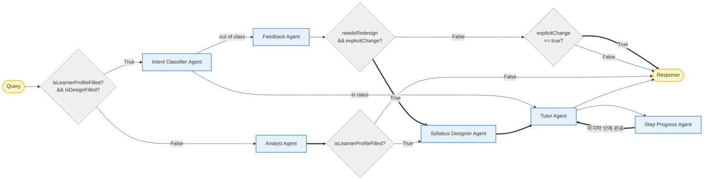
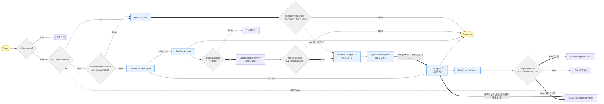
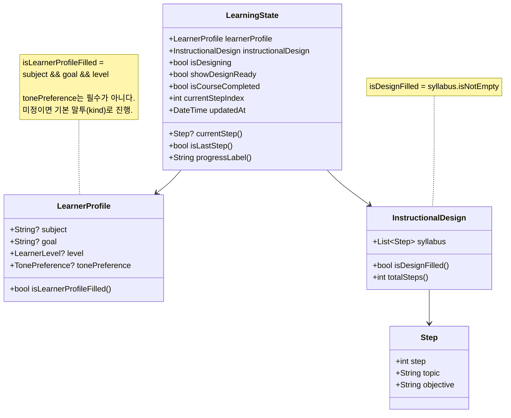
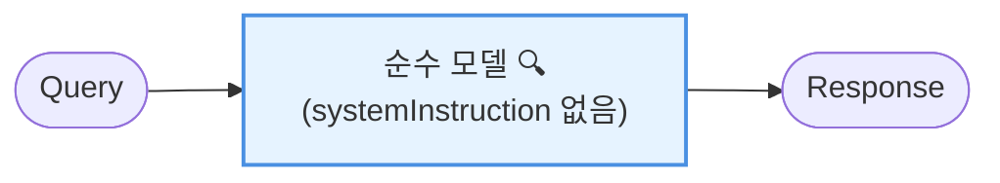

# System Flowchart

ADDIE 모델 기반 적응형 학습 튜터 시스템의 처리 흐름.

**적용 범위**: 이 문서는 **처치군(treatment)** 의 구조화 오케스트레이션을 기술한다.
대조군(control)은 라우팅이 없는 단일 호출이므로 [대조군](#대조군-control) 절에 한 문단으로 정리한다.

**자료 취득 방식**: 확정 실험설계(260624)에 따라 로컬 캐시(RAG/Wikidata)는 폐기되었다.
자료는 `Tool.googleSearch()` grounding으로 **호출 시점에** 취득하며,
검색을 가진 지점은 **Syllabus Designer 1단계**와 **학습자 대면 스트리밍** 둘뿐이다.

---

## 논문용 축약도 (Figure)

논문 Figure에 싣는 버전. **한 턴 안에서 어떤 에이전트가 어떤 순서로 도는가**만 남기고,
세션 수준 가드(중복 요청 차단·수업 완료 후 재시작)와 검색 표기는 캡션으로 뺀다.
아래 [상세 흐름](#처치군-전체-흐름-treatment)과 같은 코드를 기술하되 해상도만 다르다.



### 캡션

> 처치군의 단일 턴 처리 흐름. 초록 엣지는 학습 상태(`LearnerProfile` / `InstructionalDesign` /
> `currentStepIndex` / `isCourseCompleted`) 변경을 동반하는 전이를 나타낸다.
> Syllabus Designer와 Tutor Agent는 Google Search grounding으로 자료를 취득하며,
> 이는 대조군도 공유하는 통제 변인이다.
> Step Progress Agent는 in-class 튜터 턴 종료 후 현재 단계의 학습목표 달성 여부를 판정하여
> 진행 단계를 갱신한다. 마지막 단계가 완료되면 `isCourseCompleted`를 세우고 Tutor를 한 번 더
> 호출해 마무리 발화(종료 고지·요약·다음 안내)를 생성한다 — 완료는 앱 상태 변경일 뿐이어서
> 학습자에게 전달되는 창구가 이 발화뿐이다. 세션 수준 가드(중복 요청 차단, 수업 완료 후
> 재시작)는 도식에서 생략했다.

### 색 규칙이 갈리는 지점 (검토용)

**규칙**: 엣지는 **그 엣지를 지나는 것이 `LearningState` 갱신을 반드시 동반할 때만** 초록이다.
분기 뒤에서야 갱신이 결정되면, 분기로 들어가는 엣지는 일반이고 갈라진 쪽이 초록이다.

Figure를 다시 그릴 때 틀리기 쉬운 자리들이다.

| 엣지 | 색 | 이유 |
|------|-----|------|
| `Analyst → isLearnerProfileFilled?` | **상태 변경** | Analyst 실행 후 `updateFromExtractedInfo`가 **무조건** 호출된다 |
| `Feedback Agent → needsRedesign?` | 일반 | `needsRedesign`·`explicitChange`는 `LearningState`가 아니라 **`FeedbackResult`의 필드**다([conversational_agent_service.dart:29-45](lib/services/conversational_agent_service.dart#L29-L45)) — 영속화되지 않는 일회성 DTO다. Feedback 호출이 하는 일은 `response`를 붙이는 것뿐이고, 갱신은 `explicitChange`가 참인 쪽에서만 일어난다([chat_provider.dart:856](lib/providers/chat_provider.dart#L856)) |
| `needsRedesign && explicitChange? → True` | **상태 변경** | 이 경로는 `explicitChange`가 반드시 참 → 프로필 갱신 + 재설계 |
| `isLearnerProfileFilled? → True` | 일반 | 프로필 갱신은 직전 Analyst 엣지에서 이미 표시됨 |
| `Tutor → Step Progress Agent` | 일반 | Tutor는 상태를 바꾸지 않는다. 판정도 Tutor가 아닌 **별도 LLM 호출**이 한다 |
| `Step Progress Agent → Tutor` (마지막 단계 완료) | **상태 변경** | `markCourseCompleted()`로 `isCourseCompleted`를 세운 뒤 마무리 발화를 위해 Tutor를 다시 호출한다. 이 되돌아가는 턴은 StepProgress를 재호출하지 않는다(완료 상태에서 즉시 반환) |

---

## 처치군 전체 흐름 (treatment)



### 범례

| 표기 | 의미 |
|------|------|
| 실선 `→` | 일반 흐름 |
| 굵은 실선 `⇒` | **상태 변경**을 동반하는 흐름 (`LearningState` 갱신) |
| 점선 `-.->` | **백그라운드 병렬 실행** (`Future(...)`, UI 논블로킹) |
| 🔍 | `Tool.googleSearch()` grounding 활성 |
| 파란 사각형 | LLM Micro-Agent |
| 회색 마름모 | **앱**이 판단하는 분기 (LLM 아님) |

> 굵은 실선의 기준은 축약도의 [색 규칙](#색-규칙이-갈리는-지점-검토용)과 같다 —
> **그 엣지를 지나는 것이 반드시 상태 갱신을 동반할 때만** 굵게 그린다.
> 조건 박스로 들어가는 엣지는 갱신 여부가 아직 정해지지 않았으므로 일반이다.

> 점선과 굵은 실선은 겹칠 수 없어(mermaid 표기 한계) 백그라운드 표기가 우선한다.
> `isLearnerProfileFilled? -.-> Syllabus Designer ①` 경로는 실제로는 진입 즉시
> `setDesigning(true)`로 상태를 바꾸지만 점선으로만 표시된다.

> 검색은 독립 에이전트가 아니라 두 호출에 붙은 **도구**다.
> Intent / Analyst / Feedback / StepProgress는 검색 없는 JSON 추출기다.

---

## 라우팅 상세

### 진입 가드 (`ChatController._sendMessageImpl`)

라우팅은 위에서 아래 순서로 평가되며, 먼저 걸리는 조건에서 종료한다.

| # | 조건 | 동작 | 위치 |
|---|------|------|------|
| 0 | `isProcessing` | 입력 무시 (LLM 호출 중복 방지) | [chat_provider.dart:252](lib/providers/chat_provider.dart#L252) |
| 1 | `ExperimentConfig.isControl` | `_runFreeformFlow` → 이후 전부 건너뜀 | [chat_provider.dart:305](lib/providers/chat_provider.dart#L305) |
| 2 | `isDesigning` | 입력 무시 (설계 중 중복 요청 방지) | [chat_provider.dart:333](lib/providers/chat_provider.dart#L333) |
| 3 | `isCourseCompleted` | `_runAnalystFlow(forceAnalyst: true)` — 새 학습 시작 | [chat_provider.dart:338](lib/providers/chat_provider.dart#L338) |
| 4 | `!(isLearnerProfileFilled && isDesignFilled)` | `_runAnalystFlow` — 정보 수집 | [chat_provider.dart:346](lib/providers/chat_provider.dart#L346) |
| 5 | (위 전부 통과) | Intent 분류 → Tutor / Feedback | [chat_provider.dart:354](lib/providers/chat_provider.dart#L354) |

`isProcessing`은 백그라운드 설계와 이어지는 자동 Tutor 스트리밍까지 덮는다.
`_activeCount` 카운터로 `_enter`/`_exit`을 짝지어, `sendMessage`가 먼저 반환해도 플래그가 유지된다
([chat_provider.dart:209-229](lib/providers/chat_provider.dart#L209-L229)).

### Analyst Flow 내부 재분기

`_runAnalystFlow`는 진입 직후 상태를 한 번 더 보고 다른 Flow로 넘긴다
([chat_provider.dart:432-445](lib/providers/chat_provider.dart#L432-L445)):

| 상태 | 동작 |
|------|------|
| 프로필 O + 설계 O | → `_runFeedbackFlow`로 전환 |
| 프로필 O + 설계 X | → 곧장 `_startSyllabusDesign` |
| 그 외 | Analyst Agent 실행 (정보 추출) |

### 설계 트리거 조건

Analyst 실행 후 설계를 시작하는 조건은 단순한 `isLearnerProfileFilled`가 아니다
([chat_provider.dart:502-505](lib/providers/chat_provider.dart#L502-L505)):

```dart
shouldTriggerDesign =
    updated.learnerProfile.isLearnerProfileFilled &&
    !updated.instructionalDesign.isDesignFilled &&
    (forceAnalyst || !wasMandatory);   // 이번 턴에 처음 채워졌을 때만
```

`!wasMandatory` 조건이 있어, 이미 프로필이 차 있던 턴에는 설계가 중복 실행되지 않는다.

---

## Micro-Agent 6종

| Agent | 역할 | 모델 | 검색 | 출력 |
|-------|------|------|------|------|
| Intent Classifier | 수업 내/외 분류 | `AiModels.extractor` | ✕ | `{intent}` |
| Analyst | 프로필 정보 수집 | `AiModels.extractor` | ✕ | `{extracted_info, explicit_fields, field_confidence, response}` |
| Feedback | 피드백·재설계 요청 처리 | `AiModels.extractor` | ✕ | `{profile_update, response, needs_redesign, explicit_change, redesign_request}` |
| Syllabus Designer ① | 검색 조사 + 초안 | `AiModels.designer` | **O** | 자연어 초안 + grounding 메타데이터 |
| Syllabus Designer ② | 초안 → 구조화 | `AiModels.extractor` | ✕ | `{syllabus: [Step]}` |
| StepProgress | 단계 달성 판정 | `AiModels.extractor` | ✕ | `{step_completed, confidence}` |
| Tutor | 학습자 대면 수업 | `AiModels.tutor` | **O** | `Stream<String>` + `onGrounding` 콜백 |

### Designer를 2단계로 나눈 이유

Gemini는 `Tool.googleSearch()`와 `responseSchema`(JSON 강제)를 **한 호출에서 병용할 수 없다**.
따라서 검색이 필요한 JSON 에이전트는 반드시 쪼개야 한다
([syllabus_designer_service.dart:14-17](lib/services/syllabus_designer_service.dart#L14-L17)):

1. **① 조사**: grounding ON, 자연어 출력 — 기존 커리큘럼·공인 시험 범위·튜토리얼 목차 조사
2. **② 구조화**: grounding OFF, `responseSchema` 강제 — 초안을 `List<Step>`으로 변환

①에서 발동한 `webSearchQueries`와 근거 소스는 `groundingUsed` 이벤트로 세션 로그에 남는다.

---

## 이중 게이트 패턴

세 지점에서 **서로 다른 두 축을 모두 요구**하는 동일한 패턴을 쓴다.
불린 플래그 하나만 보면 모델이 추론한 값을 "명시적"이라 잘못 보고할 때 그대로 통과하기 때문이다.

| 지점 | 게이트 | 위치 |
|------|--------|------|
| Analyst 필드 추출 | `explicit_fields[f] && field_confidence[f] >= 0.6` | [conversational_agent_service.dart:204-208](lib/services/conversational_agent_service.dart#L204-L208) |
| Feedback 재설계 | `needs_redesign && explicit_change` | [chat_provider.dart:868](lib/providers/chat_provider.dart#L868) |
| 단계 전진 | `step_completed && confidence >= 0.6` | [chat_provider.dart:782](lib/providers/chat_provider.dart#L782) |

`needsRedesign == true && explicitChange == false`는 LLM 오판으로 간주해 무시하고 로그만 남긴다
(예: "이거 너무 어려운데요?" → 재설계 필요로 착각).

---

## 단계 진행 판정

in-class 튜터 턴이 끝날 때마다 실행된다 ([chat_provider.dart:760-806](lib/providers/chat_provider.dart#L760-L806)).

- **입력**: 현재 `Step`(topic + objective) + 최근 6턴 히스토리
- **출력**: `{step_completed, confidence}` — 불리언 신호만
- **판단**: 단계 전진/완료 처리는 **앱**이 한다 ("앱이 판단, LLM은 생성만")
  - `completed && conf ≥ 0.6 && isLastStep` → `markCourseCompleted()` **+ 마무리 발화**
  - `completed && conf ≥ 0.6` → `setCurrentStep(index + 1)` (단조 증가)
  - 그 외 → 현재 단계 유지
- **실패 시**: 예외를 삼키고 수업 흐름을 막지 않는다 (graceful degradation)

### 완료 고지

`markCourseCompleted()`는 앱 상태만 바꾼다. 판정은 튜터 턴이 **끝난 뒤** 돌기 때문에
그 시점에는 이미 답변이 화면에 나가 있어, 완료 사실을 학습자에게 알릴 창구가 없다.
그래서 완료 직후 Tutor를 한 번 더 호출한다
([chat_provider.dart:794](lib/providers/chat_provider.dart#L794)).

- 트리거: `AgentPrompts.courseClosingCue` — 세션에 저장되지 않는 합성 user 메시지.
  설계 완료 후 자동으로 수업을 시작할 때 쓰는 `'수업을 시작해줘'`와 같은 방식이다.
- 내용 규정: `AgentPrompts.tutorSystem`의 **마무리 지침**(완료 시에만 삽입).
  같은 프롬프트에서 진행 마킹도 전 단계 `✓`로 바뀐다 — 마지막 단계에 `▶`가 남으면
  모델이 아직 진행 중으로 보고 수업을 이어가려 한다.
- 재귀 없음: 이 되돌아가는 턴의 StepProgress는 `isCourseCompleted`에서 즉시 반환한다.

`isCourseCompleted`가 켜지면 그 다음 Query는 진입 가드 #3에 걸려 Analyst로 돌아간다.
Analyst 프롬프트에도 완료 상태가 주입되어(`[직전 상황]` 블록) "수업 끝났어?" 류의 확인에
먼저 끝났다고 답하고, 새 주제가 나오면 그 주제로 순환이 닫힌다.

새 주제·목표가 실제로 바뀌면 `updateFromExtractedInfo`의 `resetDesign`이 syllabus·완료
플래그·단계 인덱스를 함께 초기화하므로([learning_state_provider.dart:47](lib/providers/learning_state_provider.dart#L47)),
같은 주제를 재추출한 경우에는 아무 일도 일어나지 않는다(의도된 동작).

---

## 상태 구조



> 자료 캐시(`ResourceCache`)는 존재하지 않는다. 구버전 `SharedPreferences`에 남은
> `resourceCache` 키는 역직렬화 시 무시된다 ([learning_state.dart:86](lib/models/learning_state.dart#L86)).

### 조건 플래그

| 플래그 | 조건식 | 위치 | 의미 |
|--------|--------|------|------|
| **isLearnerProfileFilled** | `subject && goal && level` (모두 non-empty) | [learner_profile.dart:34](lib/models/learner_profile.dart#L34) | 설계에 필요한 최소 프로필 확보 |
| **isDesignFilled** | `syllabus.isNotEmpty` | [instructional_design.dart:48](lib/models/instructional_design.dart#L48) | 커리큘럼 생성 완료 |
| **isLastStep** | `totalSteps > 0 && currentStepIndex >= totalSteps - 1` | [learning_state.dart:40](lib/models/learning_state.dart#L40) | 마지막 단계 도달 |
| **isDesigning** | 수동 설정 | [learning_state.dart:12](lib/models/learning_state.dart#L12) | 설계 진행 중 (중복 방지) |
| **showDesignReady** | 수동 설정 | [learning_state.dart:13](lib/models/learning_state.dart#L13) | 설계 완료 안내 플래그 (Tutor 첫 턴에 해제) |
| **isCourseCompleted** | StepProgress 판정으로 설정 | [learning_state.dart:14](lib/models/learning_state.dart#L14) | 학습 완료 (새 학습 시작 판단용) |
| **isProcessing** | `_activeCount > 0` (휘발성, 영속화 안 함) | [chat_provider.dart:81](lib/providers/chat_provider.dart#L81) | LLM 호출 진행 중 |

---

## 세션 로깅 (실험 데이터)

상태 변화는 `StateChangeEvent` 타임라인으로 세션에 기록되어 JSON으로 내보내진다
([state_change_event.dart:77-100](lib/models/state_change_event.dart#L77-L100)).

| `StateChangeType` | 기록 시점 |
|-------------------|-----------|
| `profileUpdated` | Analyst가 프로필 필드를 갱신 |
| `syllabusGenerationStarted` / `syllabusGenerated` | 설계 시작 / 완료 |
| `redesignRequested` | Feedback이 재설계를 위임 |
| `stepAdvanced` | 단계 전진 |
| `courseCompleted` | 마지막 단계 완료 |
| `groundingUsed` | 검색 발동 (`source`: `tutor` / `designer` / `freeform`, 검색어·소스 포함) |

`groundingUsed`는 확정 실험설계 §6-4의 조절변수 **'자료 검색 빈도'** 산출에 쓰인다.

---

## 대조군 (control)

`?condition=control`로 진입하며, 위 라우팅을 **전부 건너뛴다**
([chat_provider.dart:679-748](lib/providers/chat_provider.dart#L679-L748)).



양 조건이 공유하는 **통제 변인** (`GeminiService` 공용):

- 모델: `AiModels.tutor`
- `Tool.googleSearch()` grounding 상시 활성
- 스트리밍 방식, 세션 전체 히스토리 전달

**차이는 오직 하나** — 처치군은 매 턴 재빌드한 `systemInstruction`(현재 단계·프로필 주입)을 넘기고,
대조군은 `null`을 넘겨 시스템 프롬프트 없는 순수 모델로 동작한다.

---

## 대화 메모리 정책

| 용도 | 범위 | 위치 |
|------|------|------|
| 학습자 대면 스트리밍 (양 조건) | **세션 전체 히스토리** | [`_recentMessages`](lib/providers/chat_provider.dart#L1216) |
| 판정용 에이전트 (StepProgress / Feedback) | 최근 **6턴** 윈도우 | [`_buildHistory`](lib/providers/chat_provider.dart#L1101) |

30분 단일 세션이라 컨텍스트 부담이 작고, 윈도우 잘림으로 인한 선호·맥락 망각을 없애기 위한 결정이다.
Gemini chat history는 user 메시지로 시작해야 하므로, 선두의 model 메시지는 제거하고 전달한다.
